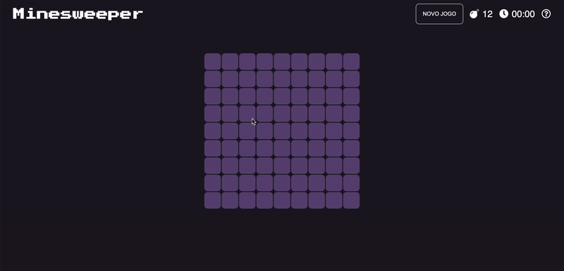

## Minesweeper :bomb:

## About:

This was a simple game I made as a personal project (yes, I used to love playing minesweeper on Windows XP) to test my Javascript skills.

The game was made entirely with HTML, CSS and pure Javascript (no frameworks allowed here!) and it features three gaming levels:

<ul>
  <li><b>Easy:</b> 9x9 grid / 12 bombs</li>
  <li><b>Medium:</b> 16x16 grid / 40 bombs</li>
  <li><b>Hard:</b> 30x16 (or 16x30) grid / 76 bombs</li>
</ul>

<b>Commands:</b>
<ul>
  <li><b>Left-click/single touch:</b> opens block.</li>
  <li><b>Right-click/long touch:</b> places flag.</li>
</ul>

The game works nicely on mobile (tested only on Android), but I recommend using Chrome browser to play it.

## Tools:
<ul>
  <li>HTML5</li>
  <li>CSS3</li>
  <li>JavaScript ES6</li>
</ul>

## In works:

Currently I am not actively working on this project. However, I would like to add the possibility for entirely custom boards, 
where the user defines how many tiles and how many bombs they want to play with.

I also plan on creating a mini tutorial for those who don't know how to play Minesweeper. But for the time being, just Google it! :)

